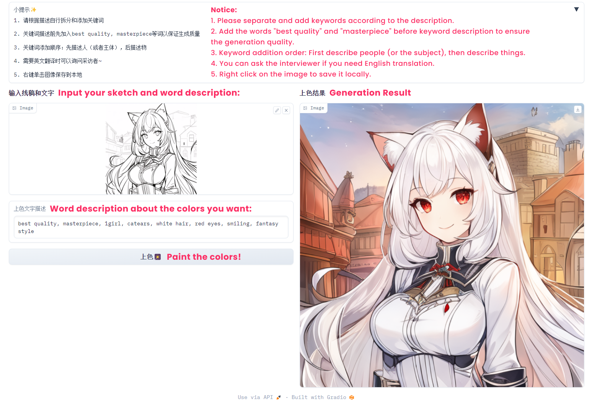

  <h1 align="center">Exploring Designers' Perceptions and Practices of Collaborating with Generative AI as a Co-creative Agent in a Multi-stakeholder Design Process: The Case of Avatar Design</h1>

  

    <a href="https://qingyanghe.com/">Qingyang He</a>*, 
    <a href="https://orcid.org/0009-0002-2550-8823">Weicheng Zheng</a>*, 
    <a href="https://orcid.org/0009-0004-4014-2908">Hanxi Bao</a>, 
    <a href="https://ruiqi-chen-0216.github.io/)"><strong>Ruiqi Chen</strong></a>, 
    <a href="https://scholar.google.ca/citations?user=XIM08ZwAAAAJ&hl=en">Xin Tong</a>
     
    *equal contribution
  

  <h2 align="center">ChineseCHI 2023</h2>

  <h3 align="center">
    <a href="https://github.com/Ruiqi-Chen-0216/0-Sketch-Paint">Code</a> | 
    <a href="https://dl.acm.org/doi/fullHtml/10.1145/3629606.3629675">Paper</a> | 
  </h3>

  

  

<strong>This work</strong> explores how designers perceive and practice collaboration with generative AI as a co-creative agent within a multi-stakeholder design process, taking avatar design as an example domain. We examine the opportunities and challenges of integrating AI into creative workflows and propose insights for designing AI-assisted tools in complex design contexts.

 

## Step 1: 0-Sketch

The codes for this step are primarily found in three notebooks: customized_stable_diffusion_pipeline.ipynb, kohya_LoRA_trainer.ipynb, and stable_diffusion_with_LoRAfile_added_ipynb.ipynb.

customized_stable_diffusion_pipeline.ipynb: This notebook is used to run and check for any bugs. If any bugs are found, they might be due to incorrect versions of the pipeline or Xformers. In this notebook, we utilized the "Anything_v_3" diffuser model. However, you can customize it by changing the model_id. Please ensure that the model_id exists and can be accessed via a URL. To generate colored images, modify the prompts and provide your own descriptions. Finally, execute the last generation process if all environments are properly set up and the pipelines are well-constructed.

stable_diffusion_with_LoRAfile_added_ipynb.ipynb: This notebook is similar to customized_stable_diffusion_pipeline.ipynb, with the addition of a function for loading LoRA weight files into UNet's attention layers. We extract weights from .safetensor files and merge them with the supported weights of the diffuser. Instead of converting the .safetensor into another format, we directly update the weight of the base model. Please note that this notebook does not support LoRA weight files containing weights for other modules like text encoder. Therefore, the example of animeoutlineV4.16.safetensors provided does not work here.

kohya_LoRA_trainer.ipynb: This notebook serves as a detailed LoRA weights trainer and can be run on Colab with GPU support. It is already customized and wrapped, requiring you to replace the parameters with your own preferences and prepare your training set. You can train the LoRA weights according to your needs. Please be aware that there might be a torch.size bug during the final training process due to changes in the versions of imported libraries used by this notebook's dependencies.

## Step 2: Sketch-Paint

For better user experience, we implement a simple GUI.
+ Dependencies are listed at the top of the file.
+ Feel free to run everything above and jump directly to the GUI part, and have fun with AI drawing 😸
